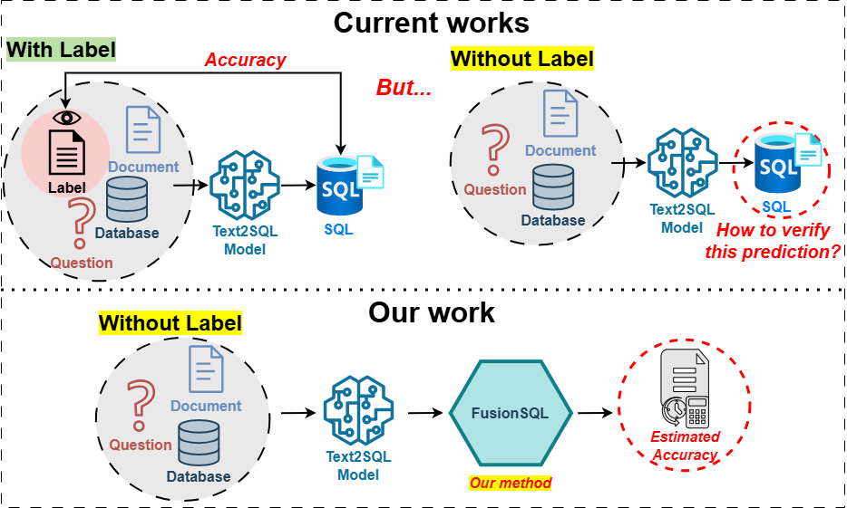
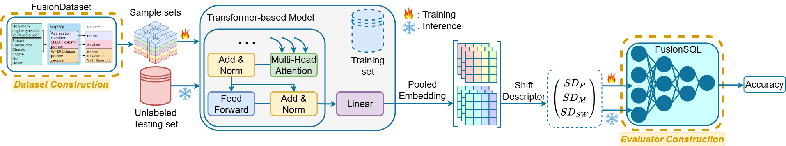

# FusionSQL

> Text2SQL evaluation, FusionDataset construction, and shift-aware regression for Text-to-SQL.



#### Citation
```
@inproceedings{fusionsql,
  author       = {Khanh Trinh Pham and Thanh Tam Nguyen and Viet Huynh and Hongzhi Yin and Quoc Viet Hung Nguyen},
  title        = {An Efficient and Effective Evaluator for Text2SQL Models on Unseen and Unlabeled Data},
  booktitle    = {ICDE},
  publisher    = {IEEE},
  year         = {2026},
}
```

## What is it?

FusionSQL provides:

- A portable evaluator that reports execution accuracy for Spider, Spider 2.0, BIRD, SParC, CoSQL, and WikiSQL.
- A pipeline to construct a synthetic FusionDataset of databases, SQLs, and paraphrased questions.
- Shift descriptors (Frechet-like, Mahalanobis, Sliced-Wasserstein) between a target workload and the training set.
- An MLP regressor that learns to predict execution accuracy for a given base model with minimal MAE.

All metrics and reports here are execution-accuracy by design.



## Project layout

- `fusion_evaluator/`
	- `data/` dataset loaders and adapters
	- `sql/` SQL normalization and parsing (sqlglot)
	- `exec/` SQLite execution with caching
	- `metrics/` execution
	- `evaluator.py` orchestrator
	- `cli.py` evaluation entrypoint
- `figure/` diagrams
- `outputs/` reports and caches

## Getting Started

### 0) Dependencies

- Python 3.10+
- SQLite (comes with Python stdlib `sqlite3`)
- Recommended: a GPU with CUDA if embedding large datasets

Install Python dependencies:
```bash
pip install -r requirements.txt
```

Torch wheels differ by platform/GPU. If the default install fails or is slow, install a matching build from the official site: [PyTorch Install](https://pytorch.org/get-started/locally/).

### 1) Datasets and expected layout

- Spider / Spider 2.0 / BIRD / SParC / CoSQL
	- Gold and predictions are JSON/JSONL with fields: `question`, `query` (gold) or `prediction` (pred), and `db_id`.
	- Databases are under `db_root/DBID/DB.sqlite`.

- WikiSQL
	- Gold/pred are JSONL; tables file is `tables.jsonl` (`id`, `header`, `rows`).
	- We materialize one SQLite per table into an output directory.

Download links:

- Spider: [Project page](https://yale-lily.github.io/spider)
- Spider 2.0: [Project page](https://spider2-sql.github.io/)
- BIRD: [Project page](https://bird-bench.github.io/)
- SParC: [Project page](https://yale-lily.github.io/sparc)
- CoSQL: [Project page](https://yale-lily.github.io/cosql)
- WikiSQL: [GitHub](https://github.com/salesforce/WikiSQL)

Place gold/pred files accordingly and provide `--db_root` pointing to per-DB folders with `DB.sqlite` for Spider/Spider2/BIRD/SParC/CoSQL.

## FusionDataset

Construct a synthetic, diverse dataset from CSV sources:

```bash
python -m fusion_evaluator.fusion_dataset.cli \
	--sources /path/to/csv_sources ... \
	--out_root outputs/fusion_dataset \
	--max_tables 1000
```

Optional LLM-driven question generation and rewrites (provide both to enable):

```bash
python -m fusion_evaluator.fusion_dataset.cli \
  --sources /path/to/csv_sources \
  --out_root outputs/fusion_dataset \
  --prompts fusion_evaluator/fusion_dataset/prompts.yaml \
  --hf_model Qwen/Qwen2.5-72B-Instruct \
  --device cuda --torch_dtype fp16 \
  --q_per_sql 4 \
  --enable_rewrites --rw_per_cat 2
```

This will:
- acquire CSVs, filter tables (language, structure, near-dup),
- synthesize relational DBs (SQLite under `outputs/fusion_dataset/databases`),
- generate SQLs and paraphrased questions with distractors (LLM-backed if provided),
- optionally produce rewritten Q/A pairs for semantic rewriting, numeric condition transforms, and query logic adjustments,
- write `outputs/fusion_dataset/fusion_dataset.jsonl`.

## FusionSQL

We embed SQLs (or questions) with a Hugging Face model, compute shift descriptors between a training workload and FusionDataset, and fit an MLP to predict execution accuracy.

### 1) Compute embeddings directly

```bash
python -m fusion_evaluator.evaluator_training.cli embed \
	--input outputs/fusion_dataset/fusion_dataset.jsonl \
	--output outputs/fusion_dataset/fusion_emb.npy \
	--model Qwen/Qwen2.5-72B-Instruct \
	--field sql \
	--device cuda \
	--batch_size 8 \
	--max_length 256 \
	--torch_dtype fp16
```

You can pass any compatible encoder from Hugging Face. Common choices include:

- `Qwen/Qwen2.5-72B-Instruct`
- `meta-llama/Llama-3.1-70B-Instruct`
- `deepseek-ai/deepseek-coder-33b-instruct`
- `XGenerationLab/XiYanSQL-QwenCoder-14B-2502`
- `cycloneboy/CscSQL-Grpo-Qwen2.5-Coder-7B-Instruct`

### 2) Train the regressor (from precomputed embeddings)

```bash
python -m fusion_evaluator.evaluator_training.cli train \
	--source_embeddings path/to/source.npy \
	--target_embeddings path/to/fusion.npy \
	--observed_metric 0.712 \
	--slices 34 \
	--hybrid_swd --pca_k 10 --rand_r 24 --pca_subsample 8192 \
	--out outputs/regressor.joblib
```

### 3) End-to-end training with FusionDataset

```bash
python -m fusion_evaluator.evaluator_training.pipeline train \
    --dataset spider \
    --gold path/to/spider_dev_gold.json \
    --pred path/to/spider_dev_preds.jsonl \
    --db_root path/to/spider/database \
    --fusion_jsonl outputs/fusion_dataset/fusion_dataset.jsonl \
    --exec_accuracy 0.712 \
    --model_name Qwen/Qwen2.5-72B-Instruct \
    --hybrid_swd --pca_k 10 --rand_r 24 --pca_subsample 8192 \
    --slices 34 \
    --out outputs/regressor_spider_qwen.joblib
```

### 4) Inference with FusionSQL

```bash
python -m fusion_evaluator.evaluator_training.pipeline infer \
    --dataset spider \
    --gold path/to/spider_dev_gold.json \
    --pred path/to/spider_dev_preds.jsonl \
    --db_root path/to/spider/database \
    --fusion_jsonl outputs/fusion_dataset/fusion_dataset.jsonl \
    --model_name Qwen/Qwen2.5-72B-Instruct \
    --hybrid_swd --pca_k 10 --rand_r 24 --pca_subsample 8192 \
    --slices 34 \
    --model outputs/regressor_spider_qwen.joblib
```

The regressor predicts execution accuracy for the target workload and chosen base model.

### 5) Sampling-based shift + true execution accuracy (small example)

This helper script repeatedly samples target subsets (e.g., 500 examples), computes shift descriptors between the training workload and each subset, then estimates **true execution accuracy** by generating SQL with a model and executing against the databases. It saves the 100 shift vectors and their accuracies, then fits a 3-layer MLP regressor.

**Example (BIRD dev):**
```bash
python -m fusion_evaluator.evaluator_training.shift_sampling_train \
  --db_root fusion_evaluator/data/bird/dev/dev_databases \
  --source fusion_evaluator/data/spider/sft_spider_train_text2sql.json \
  --target fusion_evaluator/data/bird/sft_bird_dev_text2sql.json \
  --target_limit 500 \
  --num_sets 100 \
  --seed 0 \
  --device cuda --batch_size 8 --torch_dtype fp16
```

**What it does:**
- Builds prompts from **question + schema** (same format as `shift_from_json.py`).
- Uses `Qwen/Qwen2.5-3B-Instruct` to generate SQL.
- Computes execution accuracy by running SQL against SQLite databases under `--db_root`.
- Samples 100 subsets of size 500 (no replacement per subset).
- Computes 100 shift vectors and their 100 accuracies.
- Trains a 3-layer MLP regressor `(256, 128, 64)` on these vectors.

**Outputs:**
- `outputs/shift_samples/shift_samples.npz` containing:
  - `deltas`: `(num_sets, 5)` shift vectors
  - `accuracies`: `(num_sets,)` true execution accuracies
  - `sample_indices`: `(num_sets, target_limit)` indices into the target set
- `outputs/shift_samples/shift_mlp.joblib` trained regressor

**Notes:**
- For Spider, set `--db_root` to `fusion_evaluator/data/spider/database` (or `test_database` if needed).
- If you want to reuse a different generation model, set `--model`.
- To embed with a different model than generation, set `--embed_model`.

<details>
<summary><b>Show additional usage (Spider, Spider2, BIRD, SParC, CoSQL, WikiSQL)</b></summary>

```bash
# Spider
python -m fusion_evaluator.cli \
  --dataset spider \
  --gold path/to/dev_gold.json \
  --pred path/to/predictions.jsonl \
  --db_root path/to/spider/database \
  --out outputs/spider_report.json

# Spider 2.0
python -m fusion_evaluator.cli \
  --dataset spider2 \
  --gold path/to/spider2_gold.json \
  --pred path/to/spider2_preds.jsonl \
  --db_root path/to/spider2/database \
  --out outputs/spider2_report.json

# BIRD
python -m fusion_evaluator.cli \
  --dataset bird \
  --gold path/to/bird_gold.jsonl \
  --pred path/to/bird_preds.jsonl \
  --db_root path/to/bird/database \
  --out outputs/bird_report.json

# SParC
python -m fusion_evaluator.cli \
  --dataset sparc \
  --gold path/to/sparc_dev.json \
  --pred path/to/preds.jsonl \
  --db_root path/to/spider/database \
  --out outputs/sparc_report.json

# CoSQL
python -m fusion_evaluator.cli \
  --dataset cosql \
  --gold path/to/cosql_dev.json \
  --pred path/to/preds.jsonl \
  --db_root path/to/spider/database \
  --out outputs/cosql_report.json

# WikiSQL
python -m fusion_evaluator.cli \
  --dataset wikisql \
  --gold path/to/wikisql_gold.jsonl \
  --pred path/to/wikisql_preds.jsonl \
  --wikisql_tables path/to/tables.jsonl \
  --wikisql_db_out databases/wikisql \
  --out outputs/wikisql_report.json
```

Output:
- JSON report at `--out` with `summary` and per-sample metrics.
- Console table: `ExecAcc`.
</details>

## Reported Results

`FusionSQL-TL` denotes FusionSQL Transfer Learning. `FusionSQL-ML` denotes FusionSQL Meta-learning.

<summary><b>Table III. MAE (↓) of dataset-level accuracy estimation for source-target transfers</b></summary>

Each cell reports mean ± 95% CI in percentage points. Best is in bold, second-best is underlined.

<table>
  <thead>
    <tr>
      <th>Transfer</th>
      <th>Method</th>
      <th>Qwen2.5-72B</th>
      <th>Llama-3.1-70B</th>
      <th>DeepSeek-33B</th>
      <th>XiYanSQL-14B</th>
      <th>CSC-SQL-7B</th>
      <th>Avg.</th>
    </tr>
  </thead>
  <tbody>
    <tr>
      <td rowspan="9">Spider → BIRD</td>
      <td>ATC-MC</td>
      <td>13.9 ± 1.1</td>
      <td>14.6 ± 1.2</td>
      <td>15.2 ± 1.2</td>
      <td>17.4 ± 1.4</td>
      <td>18.3 ± 1.5</td>
      <td>15.9 ± 1.3</td>
    </tr>
    <tr>
      <td>ATC-NE</td>
      <td>15.0 ± 1.2</td>
      <td>15.7 ± 1.3</td>
      <td>16.5 ± 1.3</td>
      <td>18.6 ± 1.5</td>
      <td>19.8 ± 1.6</td>
      <td>17.1 ± 1.4</td>
    </tr>
    <tr>
      <td>DoC (τ=0.8)</td>
      <td>15.5 ± 1.3</td>
      <td>16.0 ± 1.3</td>
      <td>17.3 ± 1.4</td>
      <td>19.2 ± 1.6</td>
      <td>20.5 ± 1.6</td>
      <td>17.7 ± 1.4</td>
    </tr>
    <tr>
      <td>DoC (τ=0.9)</td>
      <td>16.7 ± 1.4</td>
      <td>17.3 ± 1.4</td>
      <td>18.6 ± 1.5</td>
      <td>20.3 ± 1.7</td>
      <td>21.7 ± 1.7</td>
      <td>18.9 ± 1.5</td>
    </tr>
    <tr>
      <td>PseAutoEval</td>
      <td>11.6 ± 0.9</td>
      <td>12.2 ± 1.0</td>
      <td>13.1 ± 1.0</td>
      <td>15.1 ± 1.2</td>
      <td>16.3 ± 1.3</td>
      <td>13.7 ± 1.1</td>
    </tr>
    <tr>
      <td>BugJudge</td>
      <td>14.8 ± 1.2</td>
      <td>15.4 ± 1.2</td>
      <td>16.2 ± 1.3</td>
      <td>18.1 ± 1.4</td>
      <td>19.0 ± 1.5</td>
      <td>16.7 ± 1.3</td>
    </tr>
    <tr>
      <td>ArenaCmp</td>
      <td>9.7 ± 0.8</td>
      <td>10.4 ± 0.9</td>
      <td>11.2 ± 0.9</td>
      <td>12.6 ± 1.0</td>
      <td>13.5 ± 1.1</td>
      <td>11.5 ± 0.9</td>
    </tr>
    <tr>
      <td><u>FusionSQL-TL</u></td>
      <td><u>3.4 ± 1.2</u></td>
      <td><u>4.0 ± 1.2</u></td>
      <td><u>4.6 ± 1.3</u></td>
      <td><u>5.2 ± 1.4</u></td>
      <td><u>5.6 ± 1.4</u></td>
      <td><u>4.6 ± 1.3</u></td>
    </tr>
    <tr>
      <td><strong>FusionSQL (Ours)</strong></td>
      <td><strong>3.1 ± 0.5</strong></td>
      <td><strong>3.7 ± 0.5</strong></td>
      <td><strong>4.2 ± 0.6</strong></td>
      <td><strong>4.8 ± 0.7</strong></td>
      <td><strong>5.1 ± 0.7</strong></td>
      <td><strong>4.2 ± 0.6</strong></td>
    </tr>
    <tr>
      <td rowspan="9">WikiSQL → Spider</td>
      <td>ATC-MC</td>
      <td>12.2 ± 1.0</td>
      <td>13.1 ± 1.1</td>
      <td>13.8 ± 1.2</td>
      <td>15.2 ± 1.3</td>
      <td>16.1 ± 1.4</td>
      <td>14.1 ± 1.2</td>
    </tr>
    <tr>
      <td>ATC-NE</td>
      <td>13.4 ± 1.1</td>
      <td>14.0 ± 1.2</td>
      <td>15.1 ± 1.3</td>
      <td>16.3 ± 1.4</td>
      <td>17.5 ± 1.5</td>
      <td>15.3 ± 1.3</td>
    </tr>
    <tr>
      <td>DoC (τ=0.8)</td>
      <td>14.6 ± 1.2</td>
      <td>15.3 ± 1.3</td>
      <td>16.5 ± 1.4</td>
      <td>17.8 ± 1.5</td>
      <td>19.0 ± 1.6</td>
      <td>16.6 ± 1.4</td>
    </tr>
    <tr>
      <td>DoC (τ=0.9)</td>
      <td>15.8 ± 1.3</td>
      <td>16.4 ± 1.3</td>
      <td>17.7 ± 1.4</td>
      <td>19.1 ± 1.6</td>
      <td>20.3 ± 1.6</td>
      <td>17.9 ± 1.4</td>
    </tr>
    <tr>
      <td>PseAutoEval</td>
      <td>11.1 ± 0.9</td>
      <td>11.8 ± 1.0</td>
      <td>12.6 ± 1.0</td>
      <td>13.7 ± 1.1</td>
      <td>14.9 ± 1.2</td>
      <td>12.8 ± 1.0</td>
    </tr>
    <tr>
      <td>BugJudge</td>
      <td>13.6 ± 1.1</td>
      <td>14.2 ± 1.1</td>
      <td>15.1 ± 1.2</td>
      <td>16.5 ± 1.3</td>
      <td>17.6 ± 1.4</td>
      <td>15.4 ± 1.2</td>
    </tr>
    <tr>
      <td>ArenaCmp</td>
      <td>9.2 ± 0.8</td>
      <td>9.9 ± 0.8</td>
      <td>10.7 ± 0.9</td>
      <td>12.0 ± 1.0</td>
      <td>12.8 ± 1.0</td>
      <td>10.9 ± 0.9</td>
    </tr>
    <tr>
      <td><u>FusionSQL-TL</u></td>
      <td><u>3.6 ± 1.2</u></td>
      <td><u>4.1 ± 1.2</u></td>
      <td><u>4.7 ± 1.3</u></td>
      <td><u>5.1 ± 1.3</u></td>
      <td><u>5.6 ± 1.4</u></td>
      <td><u>4.6 ± 1.3</u></td>
    </tr>
    <tr>
      <td><strong>FusionSQL (Ours)</strong></td>
      <td><strong>3.2 ± 0.5</strong></td>
      <td><strong>3.8 ± 0.5</strong></td>
      <td><strong>4.3 ± 0.6</strong></td>
      <td><strong>4.7 ± 0.7</strong></td>
      <td><strong>5.2 ± 0.6</strong></td>
      <td><strong>4.2 ± 0.6</strong></td>
    </tr>
    <tr>
      <td rowspan="9">SParC → CoSQL (in-domain)</td>
      <td>ATC-MC</td>
      <td>6.5 ± 0.6</td>
      <td>7.2 ± 0.7</td>
      <td>7.8 ± 0.8</td>
      <td>8.3 ± 0.8</td>
      <td>9.0 ± 0.9</td>
      <td>7.8 ± 0.8</td>
    </tr>
    <tr>
      <td>ATC-NE</td>
      <td>7.1 ± 0.6</td>
      <td>7.8 ± 0.7</td>
      <td>8.4 ± 0.7</td>
      <td>9.0 ± 0.8</td>
      <td>9.6 ± 0.9</td>
      <td>8.4 ± 0.7</td>
    </tr>
    <tr>
      <td>DoC (τ=0.8)</td>
      <td>7.7 ± 0.6</td>
      <td>8.3 ± 0.7</td>
      <td>8.8 ± 0.7</td>
      <td>9.3 ± 0.8</td>
      <td>9.9 ± 0.8</td>
      <td>8.8 ± 0.7</td>
    </tr>
    <tr>
      <td>DoC (τ=0.9)</td>
      <td>8.8 ± 0.7</td>
      <td>9.3 ± 0.7</td>
      <td>9.8 ± 0.8</td>
      <td>10.4 ± 0.9</td>
      <td>10.9 ± 0.9</td>
      <td>9.8 ± 0.8</td>
    </tr>
    <tr>
      <td>PseAutoEval</td>
      <td>5.5 ± 0.5</td>
      <td>6.1 ± 0.5</td>
      <td>6.7 ± 0.6</td>
      <td>7.2 ± 0.6</td>
      <td>7.8 ± 0.7</td>
      <td>6.7 ± 0.6</td>
    </tr>
    <tr>
      <td>BugJudge</td>
      <td>6.1 ± 0.6</td>
      <td>6.7 ± 0.6</td>
      <td>7.3 ± 0.7</td>
      <td>7.9 ± 0.7</td>
      <td>8.4 ± 0.8</td>
      <td>7.3 ± 0.7</td>
    </tr>
    <tr>
      <td>ArenaCmp</td>
      <td>3.9 ± 0.4</td>
      <td>4.4 ± 0.4</td>
      <td>4.9 ± 0.5</td>
      <td>5.4 ± 0.5</td>
      <td>5.9 ± 0.5</td>
      <td>4.9 ± 0.5</td>
    </tr>
    <tr>
      <td><strong>FusionSQL-TL</strong></td>
      <td><strong>1.5 ± 1.2</strong></td>
      <td><strong>1.7 ± 1.2</strong></td>
      <td><strong>2.0 ± 1.3</strong></td>
      <td><strong>2.2 ± 1.3</strong></td>
      <td><strong>2.4 ± 1.3</strong></td>
      <td><strong>2.0 ± 1.3</strong></td>
    </tr>
    <tr>
      <td><u>FusionSQL (Ours)</u></td>
      <td><u>1.6 ± 0.3</u></td>
      <td><u>1.8 ± 0.3</u></td>
      <td><u>2.1 ± 0.3</u></td>
      <td><u>2.3 ± 0.4</u></td>
      <td><u>2.5 ± 0.4</u></td>
      <td><u>2.1 ± 0.3</u></td>
    </tr>
    <tr>
      <td rowspan="9">Spider → SynSQL-2.5M</td>
      <td>ATC-MC</td>
      <td>10.9 ± 0.9</td>
      <td>11.7 ± 1.0</td>
      <td>12.3 ± 1.0</td>
      <td>13.8 ± 1.1</td>
      <td>14.7 ± 1.2</td>
      <td>12.7 ± 1.0</td>
    </tr>
    <tr>
      <td>ATC-NE</td>
      <td>12.1 ± 1.0</td>
      <td>12.9 ± 1.1</td>
      <td>13.5 ± 1.1</td>
      <td>14.9 ± 1.2</td>
      <td>15.8 ± 1.3</td>
      <td>13.8 ± 1.1</td>
    </tr>
    <tr>
      <td>DoC (τ=0.8)</td>
      <td>12.9 ± 1.0</td>
      <td>13.6 ± 1.1</td>
      <td>14.7 ± 1.2</td>
      <td>16.0 ± 1.3</td>
      <td>17.2 ± 1.4</td>
      <td>14.9 ± 1.2</td>
    </tr>
    <tr>
      <td>DoC (τ=0.9)</td>
      <td>14.1 ± 1.1</td>
      <td>14.8 ± 1.2</td>
      <td>15.9 ± 1.3</td>
      <td>17.2 ± 1.4</td>
      <td>18.4 ± 1.5</td>
      <td>16.1 ± 1.3</td>
    </tr>
    <tr>
      <td>PseAutoEval</td>
      <td>9.5 ± 0.8</td>
      <td>10.1 ± 0.9</td>
      <td>10.8 ± 0.9</td>
      <td>12.0 ± 1.0</td>
      <td>13.1 ± 1.1</td>
      <td>11.1 ± 0.9</td>
    </tr>
    <tr>
      <td>BugJudge</td>
      <td>12.4 ± 1.0</td>
      <td>13.2 ± 1.1</td>
      <td>14.0 ± 1.1</td>
      <td>15.5 ± 1.2</td>
      <td>16.6 ± 1.3</td>
      <td>14.3 ± 1.1</td>
    </tr>
    <tr>
      <td>ArenaCmp</td>
      <td>8.4 ± 0.7</td>
      <td>9.1 ± 0.8</td>
      <td>9.8 ± 0.8</td>
      <td>11.1 ± 0.9</td>
      <td>11.9 ± 1.0</td>
      <td>10.1 ± 0.8</td>
    </tr>
    <tr>
      <td><u>FusionSQL-TL</u></td>
      <td><u>3.1 ± 1.2</u></td>
      <td><u>3.5 ± 1.2</u></td>
      <td><u>4.0 ± 1.3</u></td>
      <td><u>4.4 ± 1.3</u></td>
      <td><u>4.9 ± 1.4</u></td>
      <td><u>4.0 ± 1.3</u></td>
    </tr>
    <tr>
      <td><strong>FusionSQL (Ours)</strong></td>
      <td><strong>2.8 ± 0.4</strong></td>
      <td><strong>3.2 ± 0.5</strong></td>
      <td><strong>3.7 ± 0.5</strong></td>
      <td><strong>4.1 ± 0.6</strong></td>
      <td><strong>4.5 ± 0.6</strong></td>
      <td><strong>3.7 ± 0.5</strong></td>
    </tr>
    <tr>
      <td rowspan="9">WikiSQL → Spider 2.0</td>
      <td>ATC-MC</td>
      <td>18.0 ± 1.5</td>
      <td>18.7 ± 1.5</td>
      <td>19.6 ± 1.6</td>
      <td>21.0 ± 1.7</td>
      <td>22.2 ± 1.8</td>
      <td>19.9 ± 1.6</td>
    </tr>
    <tr>
      <td>ATC-NE</td>
      <td>19.4 ± 1.6</td>
      <td>20.1 ± 1.7</td>
      <td>21.3 ± 1.8</td>
      <td>22.6 ± 1.9</td>
      <td>23.9 ± 2.0</td>
      <td>21.5 ± 1.8</td>
    </tr>
    <tr>
      <td>DoC (τ=0.8)</td>
      <td>20.5 ± 1.7</td>
      <td>21.3 ± 1.8</td>
      <td>22.7 ± 1.9</td>
      <td>24.0 ± 2.0</td>
      <td>25.4 ± 2.1</td>
      <td>22.8 ± 1.9</td>
    </tr>
    <tr>
      <td>DoC (τ=0.9)</td>
      <td>21.7 ± 1.8</td>
      <td>22.5 ± 1.9</td>
      <td>23.9 ± 2.0</td>
      <td>25.2 ± 2.1</td>
      <td>26.6 ± 2.2</td>
      <td>23.9 ± 2.0</td>
    </tr>
    <tr>
      <td>PseAutoEval</td>
      <td>16.3 ± 1.3</td>
      <td>17.0 ± 1.4</td>
      <td>17.7 ± 1.4</td>
      <td>18.8 ± 1.5</td>
      <td>20.1 ± 1.6</td>
      <td>18.0 ± 1.4</td>
    </tr>
    <tr>
      <td>BugJudge</td>
      <td>17.3 ± 1.4</td>
      <td>18.1 ± 1.5</td>
      <td>19.3 ± 1.6</td>
      <td>20.7 ± 1.7</td>
      <td>22.0 ± 1.8</td>
      <td>19.5 ± 1.6</td>
    </tr>
    <tr>
      <td>ArenaCmp</td>
      <td>12.6 ± 1.0</td>
      <td>13.4 ± 1.1</td>
      <td>14.5 ± 1.2</td>
      <td>15.8 ± 1.3</td>
      <td>16.9 ± 1.4</td>
      <td>14.6 ± 1.2</td>
    </tr>
    <tr>
      <td><u>FusionSQL-TL</u></td>
      <td><u>4.5 ± 1.3</u></td>
      <td><u>5.1 ± 1.4</u></td>
      <td><u>5.6 ± 1.4</u></td>
      <td><u>6.1 ± 1.5</u></td>
      <td><u>6.6 ± 1.5</u></td>
      <td><u>5.6 ± 1.4</u></td>
    </tr>
    <tr>
      <td><strong>FusionSQL (Ours)</strong></td>
      <td><strong>4.2 ± 0.6</strong></td>
      <td><strong>4.8 ± 0.7</strong></td>
      <td><strong>5.3 ± 0.7</strong></td>
      <td><strong>5.8 ± 0.8</strong></td>
      <td><strong>6.3 ± 0.8</strong></td>
      <td><strong>5.3 ± 0.7</strong></td>
    </tr>
  </tbody>
</table>

<summary><b>Table IV. MAE (↓) for generalizing FusionSQL to unseen Text2SQL models</b></summary>

Columns are the unseen model pool. Each cell reports mean ± 95% CI in percentage points. Best is in bold.

<table>
  <thead>
    <tr>
      <th>Transfer</th>
      <th>Method</th>
      <th>CodeLlama-34B</th>
      <th>StarCoder2-15B</th>
      <th>Mistral-7B</th>
      <th>DeepSeek-Coder-6.7B</th>
      <th>Phi-3-mini</th>
      <th>Avg.</th>
    </tr>
  </thead>
  <tbody>
    <tr>
      <td rowspan="3">Spider → BIRD</td>
      <td>BugJudge</td>
      <td>13.8 ± 1.0</td>
      <td>13.5 ± 1.1</td>
      <td>14.0 ± 1.0</td>
      <td>13.9 ± 0.9</td>
      <td>13.6 ± 1.0</td>
      <td>13.8 ± 1.0</td>
    </tr>
    <tr>
      <td>ArenaCmp</td>
      <td>11.1 ± 0.8</td>
      <td>10.8 ± 0.9</td>
      <td>11.4 ± 0.9</td>
      <td>11.2 ± 0.9</td>
      <td>10.9 ± 0.8</td>
      <td>11.1 ± 0.9</td>
    </tr>
    <tr>
      <td><strong>FusionSQL-ML (Ours)</strong></td>
      <td><strong>6.7 ± 0.5</strong></td>
      <td><strong>6.5 ± 0.6</strong></td>
      <td><strong>6.8 ± 0.7</strong></td>
      <td><strong>6.7 ± 0.6</strong></td>
      <td><strong>6.6 ± 0.5</strong></td>
      <td><strong>6.7 ± 0.6</strong></td>
    </tr>
    <tr>
      <td rowspan="3">WikiSQL → Spider</td>
      <td>BugJudge</td>
      <td>12.7 ± 1.0</td>
      <td>12.4 ± 1.1</td>
      <td>12.9 ± 1.0</td>
      <td>12.8 ± 0.9</td>
      <td>12.5 ± 1.0</td>
      <td>12.7 ± 1.0</td>
    </tr>
    <tr>
      <td>ArenaCmp</td>
      <td>10.4 ± 0.8</td>
      <td>10.1 ± 0.9</td>
      <td>10.6 ± 1.0</td>
      <td>10.4 ± 0.9</td>
      <td>10.2 ± 0.8</td>
      <td>10.3 ± 0.9</td>
    </tr>
    <tr>
      <td><strong>FusionSQL-ML (Ours)</strong></td>
      <td><strong>6.0 ± 0.4</strong></td>
      <td><strong>5.8 ± 0.5</strong></td>
      <td><strong>6.1 ± 0.6</strong></td>
      <td><strong>6.0 ± 0.5</strong></td>
      <td><strong>5.9 ± 0.4</strong></td>
      <td><strong>6.0 ± 0.5</strong></td>
    </tr>
    <tr>
      <td rowspan="3">SParC → CoSQL</td>
      <td>BugJudge</td>
      <td>11.5 ± 0.8</td>
      <td>11.3 ± 0.9</td>
      <td>11.6 ± 1.0</td>
      <td>11.5 ± 0.9</td>
      <td>11.2 ± 0.8</td>
      <td>11.4 ± 0.9</td>
    </tr>
    <tr>
      <td>ArenaCmp</td>
      <td>9.6 ± 0.7</td>
      <td>9.4 ± 0.8</td>
      <td>9.7 ± 0.9</td>
      <td>9.6 ± 0.8</td>
      <td>9.3 ± 0.7</td>
      <td>9.5 ± 0.8</td>
    </tr>
    <tr>
      <td><strong>FusionSQL-ML (Ours)</strong></td>
      <td><strong>5.1 ± 0.4</strong></td>
      <td><strong>4.9 ± 0.5</strong></td>
      <td><strong>5.1 ± 0.6</strong></td>
      <td><strong>5.0 ± 0.5</strong></td>
      <td><strong>4.9 ± 0.4</strong></td>
      <td><strong>5.0 ± 0.5</strong></td>
    </tr>
    <tr>
      <td rowspan="3">Spider → SynSQL-2.5M</td>
      <td>BugJudge</td>
      <td>13.3 ± 1.0</td>
      <td>13.0 ± 1.1</td>
      <td>13.4 ± 1.0</td>
      <td>13.2 ± 0.9</td>
      <td>13.1 ± 1.0</td>
      <td>13.2 ± 1.0</td>
    </tr>
    <tr>
      <td>ArenaCmp</td>
      <td>10.9 ± 0.8</td>
      <td>10.6 ± 0.9</td>
      <td>11.0 ± 1.0</td>
      <td>10.9 ± 0.9</td>
      <td>10.7 ± 0.8</td>
      <td>10.8 ± 0.9</td>
    </tr>
    <tr>
      <td><strong>FusionSQL-ML (Ours)</strong></td>
      <td><strong>6.5 ± 0.5</strong></td>
      <td><strong>6.3 ± 0.6</strong></td>
      <td><strong>6.6 ± 0.7</strong></td>
      <td><strong>6.5 ± 0.6</strong></td>
      <td><strong>6.4 ± 0.5</strong></td>
      <td><strong>6.5 ± 0.6</strong></td>
    </tr>
    <tr>
      <td rowspan="3">WikiSQL → Spider 2.0</td>
      <td>BugJudge</td>
      <td>14.6 ± 1.0</td>
      <td>14.2 ± 1.1</td>
      <td>14.7 ± 1.2</td>
      <td>14.5 ± 1.1</td>
      <td>14.3 ± 1.0</td>
      <td>14.5 ± 1.1</td>
    </tr>
    <tr>
      <td>ArenaCmp</td>
      <td>12.0 ± 0.9</td>
      <td>11.7 ± 1.0</td>
      <td>12.1 ± 1.1</td>
      <td>12.0 ± 1.0</td>
      <td>11.8 ± 0.9</td>
      <td>11.9 ± 1.0</td>
    </tr>
    <tr>
      <td><strong>FusionSQL-ML (Ours)</strong></td>
      <td><strong>7.0 ± 0.5</strong></td>
      <td><strong>6.8 ± 0.6</strong></td>
      <td><strong>7.1 ± 0.7</strong></td>
      <td><strong>7.0 ± 0.6</strong></td>
      <td><strong>6.9 ± 0.5</strong></td>
      <td><strong>7.0 ± 0.6</strong></td>
    </tr>
  </tbody>
</table>

<summary><b>Table VI. MAE (↓) on classic Text2SQL models such as ATHENA++</b></summary>

Each cell reports mean ± 95% CI in percentage points. Best is in bold, second-best is underlined.

<table>
  <thead>
    <tr>
      <th>Dataset</th>
      <th>Method</th>
      <th>ATHENA</th>
      <th>ATHENA++</th>
      <th>SQLizer</th>
      <th>Avg.</th>
    </tr>
  </thead>
  <tbody>
    <tr>
      <td rowspan="5">Spider</td>
      <td>BugJudge</td>
      <td>12.0 ± 1.0</td>
      <td>11.8 ± 0.9</td>
      <td>12.1 ± 1.0</td>
      <td>12.0 ± 1.0</td>
    </tr>
    <tr>
      <td><u>ArenaCmp</u></td>
      <td><u>10.8 ± 0.9</u></td>
      <td><u>10.6 ± 0.8</u></td>
      <td><u>10.9 ± 0.9</u></td>
      <td><u>10.8 ± 0.9</u></td>
    </tr>
    <tr>
      <td>FusionSQL-TL</td>
      <td>14.3 ± 1.1</td>
      <td>14.1 ± 1.1</td>
      <td>14.4 ± 1.2</td>
      <td>14.3 ± 1.2</td>
    </tr>
    <tr>
      <td>FusionSQL-LLM</td>
      <td>12.8 ± 1.1</td>
      <td>12.6 ± 1.0</td>
      <td>12.9 ± 1.1</td>
      <td>12.8 ± 1.1</td>
    </tr>
    <tr>
      <td><strong>FusionSQL</strong></td>
      <td><strong>8.3 ± 0.6</strong></td>
      <td><strong>8.2 ± 0.7</strong></td>
      <td><strong>8.4 ± 0.8</strong></td>
      <td><strong>8.3 ± 0.7</strong></td>
    </tr>
    <tr>
      <td rowspan="5">Spider 2.0</td>
      <td>BugJudge</td>
      <td>12.8 ± 1.1</td>
      <td>12.6 ± 1.0</td>
      <td>12.9 ± 1.1</td>
      <td>12.8 ± 1.1</td>
    </tr>
    <tr>
      <td><u>ArenaCmp</u></td>
      <td><u>11.6 ± 0.8</u></td>
      <td><u>11.4 ± 0.9</u></td>
      <td><u>11.7 ± 1.0</u></td>
      <td><u>11.6 ± 0.9</u></td>
    </tr>
    <tr>
      <td>FusionSQL-TL</td>
      <td>15.1 ± 1.1</td>
      <td>14.9 ± 1.2</td>
      <td>15.2 ± 1.3</td>
      <td>15.1 ± 1.2</td>
    </tr>
    <tr>
      <td>FusionSQL-LLM</td>
      <td>13.6 ± 1.0</td>
      <td>13.4 ± 1.0</td>
      <td>13.7 ± 1.2</td>
      <td>13.6 ± 1.1</td>
    </tr>
    <tr>
      <td><strong>FusionSQL</strong></td>
      <td><strong>9.0 ± 0.6</strong></td>
      <td><strong>8.9 ± 0.7</strong></td>
      <td><strong>9.1 ± 0.8</strong></td>
      <td><strong>9.0 ± 0.7</strong></td>
    </tr>
    <tr>
      <td rowspan="5">SynSQL-2.5M</td>
      <td>BugJudge</td>
      <td>13.0 ± 1.1</td>
      <td>12.8 ± 1.1</td>
      <td>13.1 ± 1.1</td>
      <td>13.0 ± 1.1</td>
    </tr>
    <tr>
      <td><u>ArenaCmp</u></td>
      <td><u>11.8 ± 0.8</u></td>
      <td><u>11.6 ± 0.9</u></td>
      <td><u>11.9 ± 1.0</u></td>
      <td><u>11.8 ± 0.9</u></td>
    </tr>
    <tr>
      <td>FusionSQL-TL</td>
      <td>15.3 ± 1.2</td>
      <td>15.1 ± 1.2</td>
      <td>15.4 ± 1.3</td>
      <td>15.3 ± 1.3</td>
    </tr>
    <tr>
      <td>FusionSQL-LLM</td>
      <td>13.7 ± 1.1</td>
      <td>13.5 ± 1.1</td>
      <td>13.8 ± 1.2</td>
      <td>13.7 ± 1.1</td>
    </tr>
    <tr>
      <td><strong>FusionSQL</strong></td>
      <td><strong>9.1 ± 0.6</strong></td>
      <td><strong>9.0 ± 0.7</strong></td>
      <td><strong>9.2 ± 0.8</strong></td>
      <td><strong>9.1 ± 0.7</strong></td>
    </tr>
    <tr>
      <td rowspan="5">CoSQL</td>
      <td>BugJudge</td>
      <td>11.5 ± 0.8</td>
      <td>11.3 ± 0.9</td>
      <td>11.6 ± 1.0</td>
      <td>11.5 ± 0.9</td>
    </tr>
    <tr>
      <td><u>ArenaCmp</u></td>
      <td><u>10.2 ± 0.8</u></td>
      <td><u>10.0 ± 0.7</u></td>
      <td><u>10.3 ± 0.8</u></td>
      <td><u>10.2 ± 0.8</u></td>
    </tr>
    <tr>
      <td>FusionSQL-TL</td>
      <td>13.8 ± 1.1</td>
      <td>13.6 ± 1.1</td>
      <td>13.9 ± 1.2</td>
      <td>13.8 ± 1.2</td>
    </tr>
    <tr>
      <td>FusionSQL-LLM</td>
      <td>12.3 ± 1.1</td>
      <td>12.1 ± 1.0</td>
      <td>12.4 ± 1.1</td>
      <td>12.3 ± 1.1</td>
    </tr>
    <tr>
      <td><strong>FusionSQL</strong></td>
      <td><strong>7.9 ± 0.5</strong></td>
      <td><strong>7.8 ± 0.6</strong></td>
      <td><strong>8.0 ± 0.7</strong></td>
      <td><strong>7.9 ± 0.6</strong></td>
    </tr>
    <tr>
      <td rowspan="5">BIRD</td>
      <td>BugJudge</td>
      <td>13.2 ± 1.1</td>
      <td>13.0 ± 1.0</td>
      <td>13.3 ± 1.1</td>
      <td>13.2 ± 1.1</td>
    </tr>
    <tr>
      <td><u>ArenaCmp</u></td>
      <td><u>12.0 ± 0.9</u></td>
      <td><u>11.8 ± 0.8</u></td>
      <td><u>12.1 ± 0.9</u></td>
      <td><u>12.0 ± 0.9</u></td>
    </tr>
    <tr>
      <td>FusionSQL-TL</td>
      <td>15.5 ± 1.3</td>
      <td>15.3 ± 1.2</td>
      <td>15.6 ± 1.3</td>
      <td>15.5 ± 1.3</td>
    </tr>
    <tr>
      <td>FusionSQL-LLM</td>
      <td>13.9 ± 1.2</td>
      <td>13.7 ± 1.1</td>
      <td>14.0 ± 1.2</td>
      <td>13.9 ± 1.2</td>
    </tr>
    <tr>
      <td><strong>FusionSQL</strong></td>
      <td><strong>9.2 ± 0.6</strong></td>
      <td><strong>9.1 ± 0.7</strong></td>
      <td><strong>9.3 ± 0.8</strong></td>
      <td><strong>9.2 ± 0.7</strong></td>
    </tr>
  </tbody>
</table>

---

If you run into issues or need helper scripts for dataset downloads/materialization, open an issue or reach out.

-----------
**Backup Statistics**


